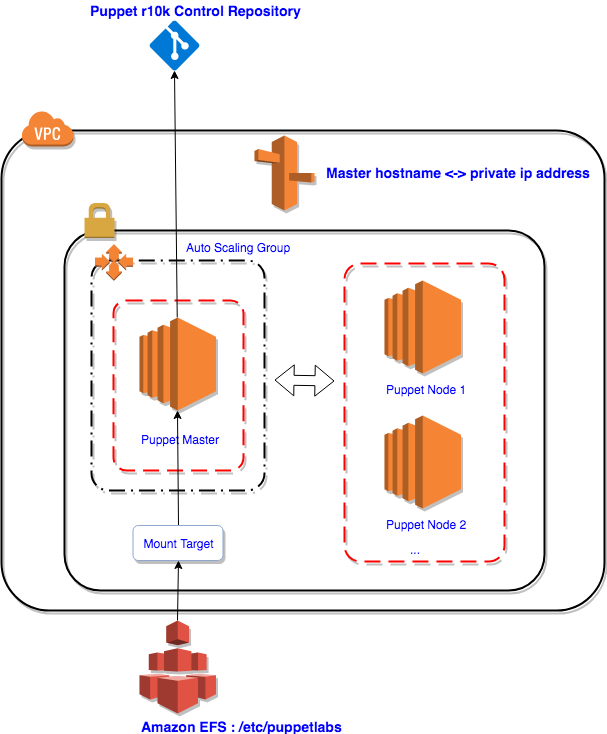

# Puppet Open Source Version 5.5 on AWS

## Deploy a Puppet master and Puppet agents on Amazon EC2 using Terraform

[Puppet](https://puppet.com/) is one of the most widely used configuration management and automation systems. This blog post shows an automated solution via Terraform to deploy Puppet Open Source to AWS.

The solution provisions Puppet master with high availability setup, register multiple nodes to the puppet master automatically, and configure a sample r10k control repository to manage the puppet environment. All instances are based on [Amazon Linux 2](https://aws.amazon.com/amazon-linux-2/).

Here is the solution architecture:


To make sure the puppet master is highly available and self-healing, we put master node in an auto-scaling group (ASG) and use EFS to store the main puppet configurations (/etc/puppetlabs). When the puppet master node is down, the auto-scaling group will spin up a new puppet master with the same configurations, and the new master will mount the EFS to get the certificates and configurations of the previews master, so the puppet nodes can connect to the new master automatically without regenerating certificates.

Puppet nodes use master hostname to locat master instance, to make sure puppet nodes can resolve the master hostname, the solution also provisions a record set for puppet mater instance in a Route 53 private zone to map the puppet master hostname and its private IP address. The solution also update the record set with the new IP address after master node gets recovered.

## Implementation Details

Now let's talk about the detailed implementation and key considerations of the solution.

### Puppet Master

Amazon Linux 2 is a good fit for the puppet master since it has the systemd support (amazon Linux v1 doesn't support systemd) which is required when bootstrapping puppet, and it comes with many AWS tools (e.g. AWS CLI) which help reduce the execution time of EC2 user data. Here are the steps to set up puppet master node:

1. Mount EFS Volume to the master node

Mount an EFS volume to the directory /etc/puppetlabs which will be used to store puppet certificates and configurations.

```bash
yum install -y amazon-efs-utils
mkdir /etc/puppetlabs
mount -t efs fs-de0ab596:/ ${efs_dns_name}:/ /etc/puppetlabs
```

Note: If you are not using Amazon Linux 2, please refer to instructions [Mount File Systems](https://docs.aws.amazon.com/efs/latest/ug/mounting-fs.html) to mount the EFS volume to your instance.

2. Create/Update Route 53 DNS record of the puppet master node

```bash
declare -x INPUT_JSON=$(cat <<EOF
'{
    "HostedZoneId": "${hosted_zone_id}", 
    "ChangeBatch": {
        "Comment": "Update the A record set", 
        "Changes": [
            {
                "Action": "UPSERT", 
                "ResourceRecordSet": {
                    "Name": "${master_hostname}", 
                    "Type": "A",            
                    "TTL": 300, 
                    "ResourceRecords": [
                        {
                            "Value": "$(curl --silent --show-error --retry 3 http://169.254.169.254/latest/meta-data/local-ipv4)"
                        }
                    ]
                }
            }
        ]
    }
}'
EOF
)

eval aws route53 change-resource-record-sets --cli-input-json $INPUT_JSON
```

3. Install puppet on master node

If this is the first time the puppet master node is launched (folder /etc/puppetlabs/ is empty), install and configure puppet server directly.

* Add [puppet repository](https://yum.puppet.com/puppet5/) on both puppet and agent node

* Install puppet server on the puppet master node

* Configure the puppet master with correct certname and dns_alt_name settings, and set autosign to true to sign the node certificate requests automatically. This will update settings in /etc/puppetlabs/puppet/puppet.conf, you can update more settings based on your need using command like "puppet config set ...". For the details about how to configure the parameters in puppet.conf file, please refer to [Config files: The main config file (puppet.conf)](https://puppet.com/docs/puppet/5.3/config_file_main.html).

```bash

# Install puppet server
rpm -Uvh ${puppet_repo}
yum -y install puppetserver
export PATH=/opt/puppetlabs/bin:$PATH

# Configure puppet master
puppet config set certname ${master_hostname} --section main
puppet config set dns_alt_names puppet,${master_hostname} --section master
puppet config set autosign true --section master
```

If the puppet master is down, and auto-scaling group spin up another puppet master, the EFS volume should keep all files under /etc/puppetlabs, so folder /etc/puppetlabs/ is not empty. In this case, once the new master is up, the user data will back up /etc/puppetlabs/ folder to /tmp/puppetbackups/, and then install puppet server, after installation completed, over-write /etc/puppetlabs/ with the contents in the backup folder.

```bash

# Backup master configurations
mkdir /tmp/puppetbackup
rm -rf /tmp/puppetbackup/*
cp -a /etc/puppetlabs/. /tmp/puppetbackup

# Install puppet server
rpm -Uvh https://yum.puppet.com/puppet5/puppet5-release-el-7.noarch.rpm
yum -y install puppetserver
export PATH=/opt/puppetlabs/bin:$PATH

# Configure puppet master
puppet config set certname ${master_hostname} --section main
puppet config set dns_alt_names puppet,${master_hostname} --section master
puppet config set autosign true --section master

# Restore master configurations
rm -rf /etc/puppetlabs/*
cp -a /tmp/puppetbackup/. /etc/puppetlabs
```

4. Start puppet server

```bash
# Start the puppet master and add the service to start up
systemctl start puppetserver
systemctl enable puppetserver
```

### Puppet Agents

Install and configure puppet agents is very easy, you only need to install the puppet repository on the nodes, and then install and start the puppet service. There is only one configuration need to be set to make sure the agent node can register to the correct master node - set the "server" to the master node host name in the main section of the puppet.conf file.

```bash
# Install puppet agent
rpm -Uvh https://yum.puppet.com/puppet5/puppet5-release-el-7.noarch.rpm
yum -y install puppet-agent
export PATH=/opt/puppetlabs/bin:$PATH

# Configure the server name of the agent to the master hostname
puppet config set server ${master_hostname} --section main

# Start puppet agent and add the service to start up
puppet resource service puppet ensure=running enable=true
```

### Set up R10K control repository

r10k is a tool to help manage dynamic environments. It can handle creating new environments from git branches and deploying a set of modules to that environment. For the details of r10k, please check the README file at [r10k's github site](http://terrarum.net/blog/puppet-infrastructure-with-r10k.html).

* Install r10k is simple:
```
/opt/puppetlabs/puppet/bin/gem install r10k
```

* Configure r10k with /etc/r10k.yaml
r10k configuration file (/etc/r10k.yaml) manages the configuration options for the 'r10k deploy' command. Here is the most basic configurations for r10k. Please set remote to the git control repository for r10k which may located in GitLab, BitBucket, or GitHub. In this solution, the control repository is in github which forked from PuppetLab's [https://github.com/puppetlabs/control-repo.git](https://github.com/puppetlabs/control-repo.git)

```yaml
---
:cachedir: '/var/cache/r10k'

:sources:
  :base:
    remote: '${r10k_repo}'
    basedir: '/etc/puppetlabs/code/environments'
```

* Finally, run r10k:
```
r10k deploy environment -p
```

Note: If the git repository is private, you need to manage the RSA public and private keys for the puppet master to connect to r10k control repository. Apparently save the RSA keys in the repository is not safe way, so suggest using AWS Systems Manager Parameter Store or AWS Secrets Manager to keep the RSA keys safe and use user data to retrieve the keys. If using the AWS Systems Manager Parameter Store, you need to make sure the RSA keys are added in the Parameter Store using AWS CLI, if you upload the keys using AWS console, it will save replace the new line character with space character, and the RSA private key won't work. So use below commands to add RSA keys into parameter store:
```bash
aws ssm put-parameter --name "rsa_private_key_name" --type "String" --value file:///root/.ssh/id_rsa --region us-east-1

aws ssm put-parameter --name "rsa_public_key_name" --type "String" --value file:///root/.ssh/id_rsa.pub --region us-east-1
```
And then you can retrieve the RSA public and private keys and save them to the puppet master node as below:
```bash
rsa_private_key=$(/usr/local/bin/aws ssm get-parameters --names ${rsa_private_key_name} --with-decryption --region ${aws_region} | jq -r '.Parameters[0].Value')

rsa_public_key=$(/usr/local/bin/aws ssm get-parameters --names ${rsa_public_key_name} --with-decryption --region ${aws_region} | jq -r '.Parameters[0].Value')

    cat > /root/.ssh/id_rsa <<- EOM
$rsa_private_key
EOM

cat > /root/.ssh/id_rsa.pub <<- EOM
$rsa_public_key
EOM

chmod 400 /root/.ssh/id_rsa
chmod 400 /root/.ssh/id_rsa.pub
```

## Deploy and Test the solution

You can folk or download the solution from [https://github.com/1Strategy](https://github.com/1Strategy/deploy_puppet5_env_on_AWS_with_terraform), create an terraform.tfvars file with below parameters initialized:

| Parameters              | Details                                               | Default Value |
| ----------------------- |:----------------------------------------------------- |:--------------|
| aws_access_key          |aws_access_key of your IAM user                        | N/A           |
| aws_secret_key          |aws_secret_key of your IAM user                        | N/A           |
| ssh_key_name            |The ssh key name which will be used to log on to master| N/A           |
| r10k_repository         |r10k control repository url                            | N/A           |
| puppet_repository       |puppet rpm package url to be installed                 |https://yum.puppet.com/puppet5/puppet5-release-el-7.noarch.rpm                                    |
| vpc_id                  |vpc which will holds the puppet master                 | N/A           |
| subnet_id               |the subnet of the puppet master will be launched in    | N/A           |
| instance_type           |EC2 instance type of the puppet master                 | t2.medium     |
| puppet_master_name      |The puppet master name which will be part of hostname  | puppet.master |
| aws_route53_zone_name   |Route53 private host zone name                         | private       |
| asg_min                 |For single master, set it to "1"                       | 1             |
| asg_max                 |For single master, set it to "1"                       | 1             |

Note: For the instance_type, t2.medium is the minimum,otherwise, you may get memory is not enough error and the master won't work.

Then fo to terraform folder and deploy the solution with below commands:

```terraform
terraform init
terraform plan
terraform apply
```

If everything works well, when you log on to the master server, /etc/puppetlabs/code/environments/production/ should exist with the files from [r10k control repository](https://github.com/puppetlabs/control-repo):

```bash
[root@puppet production]# ls
data              hiera.yaml  manifests   README.md  site
environment.conf  LICENSE     Puppetfile  scripts 
```

If you log on to the puppet agent node, and type "puppet agent --test" as root user, the puppet agent should be able to retrieve the catalog successfully:
```bash
[root@puppet-agent-hostname ~]# puppet agent --test
Info: Using configured environment 'production'
Info: Retrieving pluginfacts
Info: Retrieving plugin
Info: Retrieving locales
Info: Caching catalog for puppet-agent-hostname
Info: Applying configuration version 'puppet.master.private-production-78662f908d0'
Notice: Applied catalog in 0.01 seconds
```

## Conclusion
This solution deploys Open Source Puppet version 5.5.1 by default via Terraform. Open Source Puppet is available to download and use under the Apache 2.0 license. If you have further questions, feel free to schedule a consultation with us or email me directly at [jing@1strategy.com](jing@1strategy.com).

## License
Licensed under the Apache License, Version 2.0.